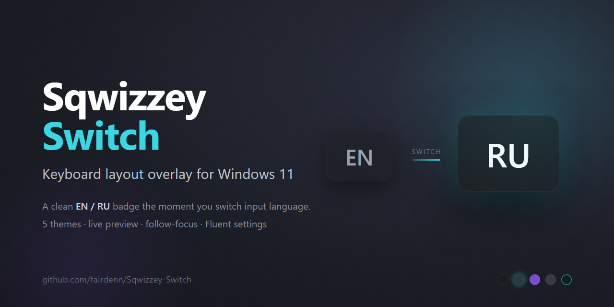
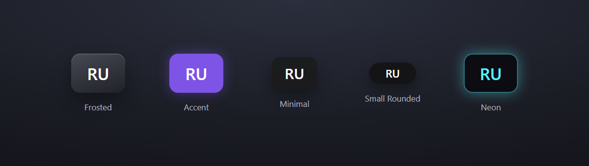

<p align="center">
  
</p>

<h1 align="center">Sqwizzey Switch</h1>

<p align="center">
  A lightweight keyboard-layout overlay for Windows 11 — a small <b>EN / RU</b> badge when you switch input language, macOS-style.
  <br>
  <b>English</b> · <a href="README.ru.md">Русский</a>
</p>

## How it works

1. **Switch your layout** (Win+Space / Alt+Shift) — a badge with the language code fades in, then disappears on its own.
2. **Turn on "active-window mode"** — the badge appears on the window you're focused on and *slides to its centre* whenever you switch apps, so you always know the current language where you're typing.
3. **Make it yours** — pick a style, position, animations and timing in the Fluent settings window, with a live preview.

## Themes

<p align="center">
  
</p>

## Features

- Centered overlay badge on layout switch, with scramble + spring animations
- **Active-window mode** — badge follows the focused window and slides to its centre
- 5 theme presets with a live preview
- Adjustable duration, opacity, position and X/Y offset
- Skip fullscreen apps (games) · Start with Windows
- Multi-language UI: **Auto + English, Русский, Українська, Español, Deutsch, Français, 中文, Português**
- Click-through, hidden from Alt+Tab, multi-monitor with per-monitor DPI

## Tray language icon

Settings has a **"Show language on the tray icon"** option — the icon shows the active window's
language (styles: text-only like Windows, circle, rounded square), with a `current → next`
tooltip on hover.

> **Recommended:** to replace the standard Windows language indicator with just this icon,
> install the [**Taskbar tray system icon tweaks**](https://windhawk.net/mods/taskbar-tray-system-icon-tweaks)
> mod (Windhawk) and enable **Hide language bar**. The app can't hide the standard indicator
> itself: Windows stores this nowhere in the registry/API — it can only be hidden by injecting
> into Explorer (which the mod does). Our indicator + that mod pair up nicely.

## Download

Grab the installer from the [latest release](../../releases/latest) — `SqwizzeySwitch-Setup-1.2.0.exe`. No administrator rights required; the app is self-contained (no .NET install needed).

## Build from source

Requires the [.NET 8 SDK](https://dotnet.microsoft.com/download/dotnet/8.0) (and [Inno Setup](https://jrsoftware.org/isdl.php) for the installer).

```cmd
git clone https://github.com/fairdenn/Sqwizzey-Switch.git
cd Sqwizzey-Switch

dotnet run                                   :: dev run

dotnet publish -c Release -r win-x64 --self-contained true ^
  -p:PublishSingleFile=true -o publish\      :: self-contained .exe

iscc setup.iss                               :: installer (needs Inno Setup)
```

## Tech stack

C# · .NET 8 · WPF · [WPF-UI](https://github.com/lepoco/wpfui) · Win32 API
